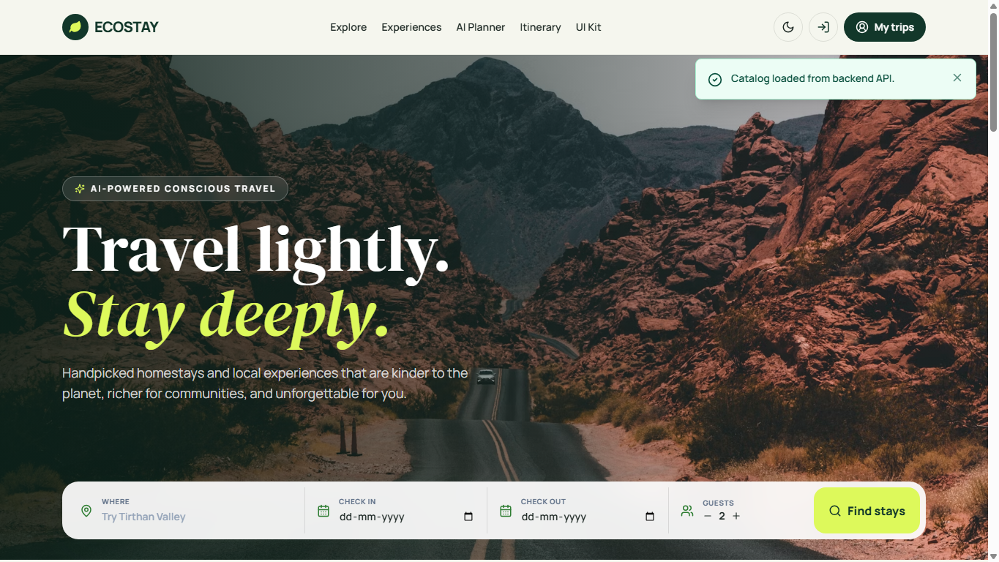
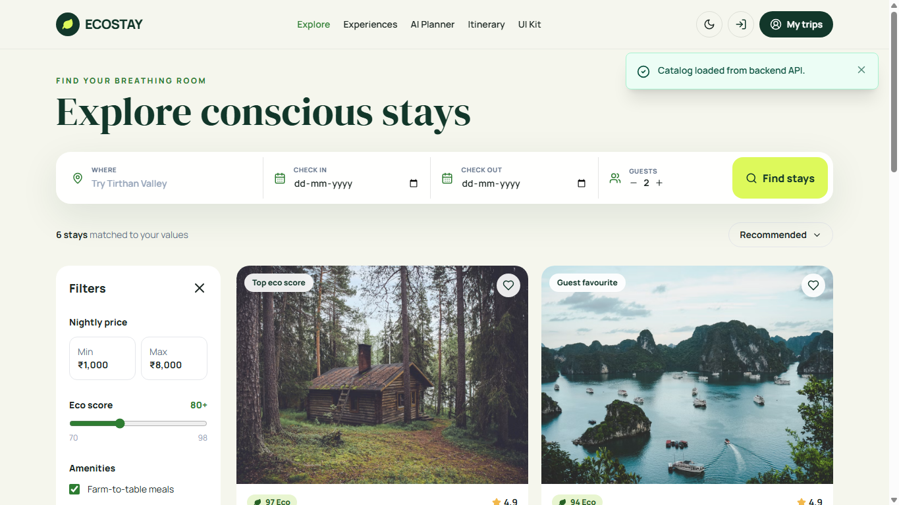
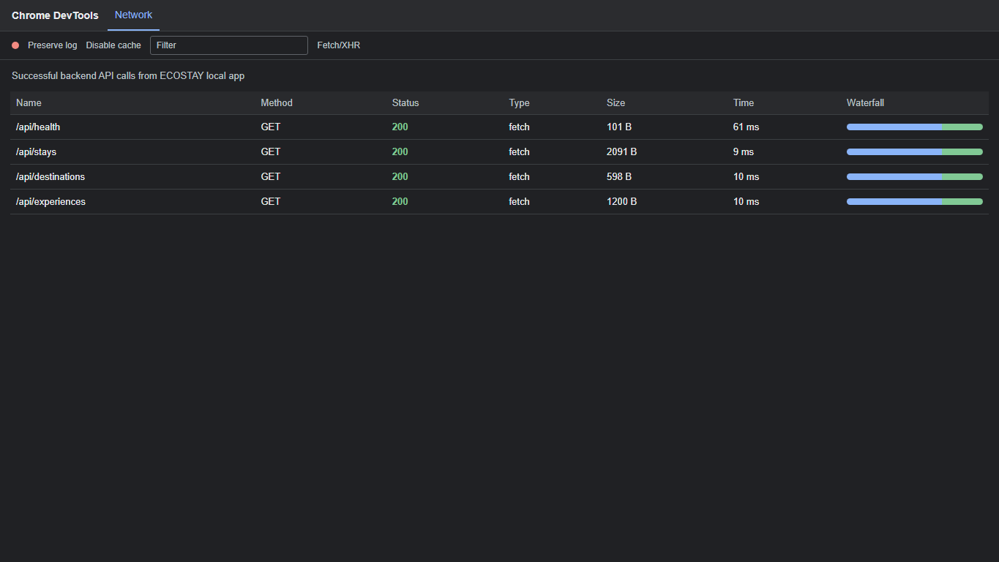

# Backend API Screenshot Evidence

Caption: Home page showing destination and stay cards loaded from the Express backend API.

Caption: Explore page showing the API-backed stay catalog and eco-score filter using backend data.

Caption: Chrome DevTools Network evidence showing successful GET requests to ECOSTAY backend endpoints with HTTP 200 status codes.
